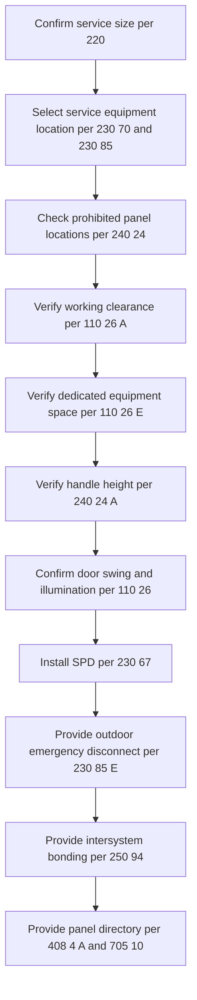
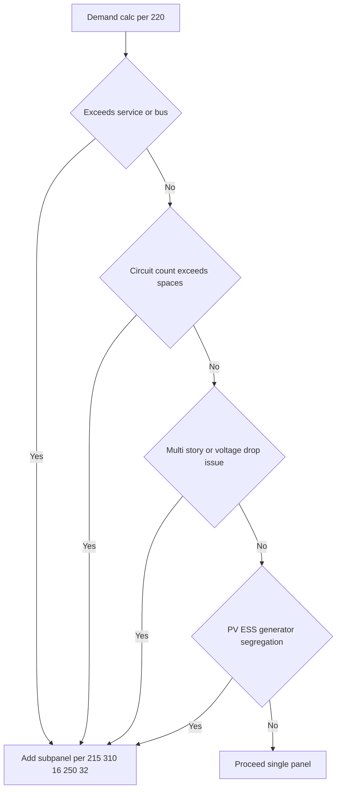
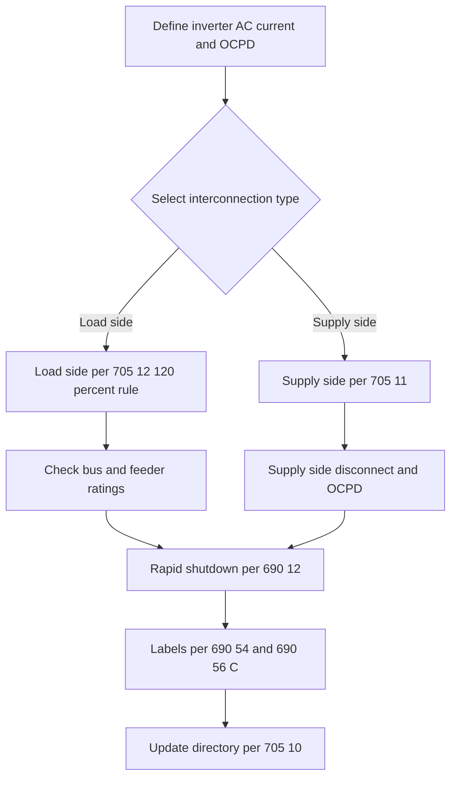
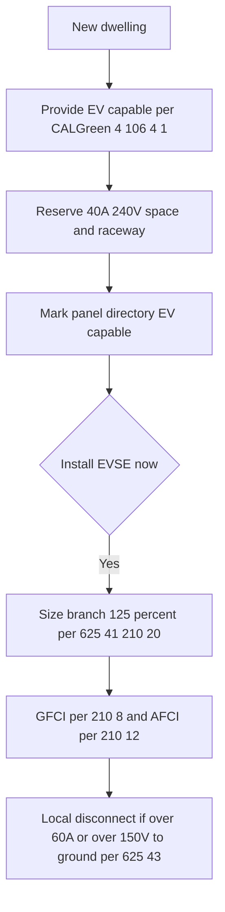
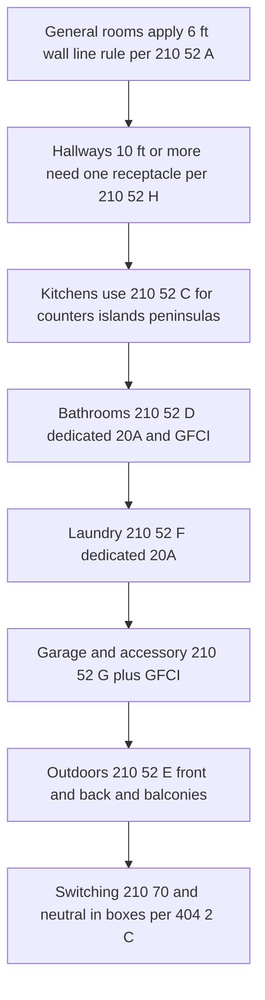
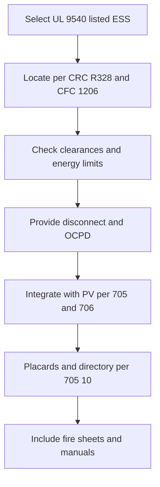

# CORRECTIONS/ADDITIONS TO: California Residential Electrical Design & Permit Workflow (2025+)

## Executive Summary (unchanged core + ADDING outlet/switch highlights)

- **General living areas**: 6-ft rule along wall line; any wall space ≥2 ft wide requires coverage; hallways ≥10 ft need a receptacle. ([Mike Holt Enterprises](https://www.mikeholt.com/files/PDF/23_UNEC1_210.52.pdf?utm_source=chatgpt.com), [Electrical License Renewal](https://www.electricallicenserenewal.com/Electrical-Continuing-Education-Courses/NEC-Content.php?sectionID=237.0&utm_source=chatgpt.com), [ElecPro Info](https://forums.mikeholt.com/threads/hallway-receptacles.2552027/?utm_source=chatgpt.com))
- **Kitchens**: counter/work-surface outlets per 210.52(C); **2023 changes** clarify locations and remove below-counter options previously allowed—use on-counter, in-counter listed assemblies, or ≤20 in above. Islands/peninsulas governed by 210.52(C)(2)(3). ([Electrical License Renewal](https://www.electricallicenserenewal.com/Electrical-Continuing-Education-Courses/NEC-Content.php?sectionID=1435&utm_source=chatgpt.com), [Default](https://www.ecmag.com/magazine/articles/article-detail/codes-standards-everything-kitchen-sink-determining-number-and-location-receptacles?utm_source=chatgpt.com))
- **Switching**: wall-switch-controlled lighting outlets where required by 210.70; 3-way switching for stairways with ≥6 risers; **neutral in most switch boxes** (404.2(C)). ([Electrical License Renewal](https://www.electricallicenserenewal.com/Electrical-Continuing-Education-Courses/NEC-Content.php?sectionID=242.1&utm_source=chatgpt.com))
- **TR receptacles**: required in dwelling areas listed in 406.12. ([Electrical License Renewal](https://www.electricallicenserenewal.com/Electrical-Continuing-Education-Courses/NEC-Content.php?sectionID=1495.0&utm_source=chatgpt.com))

------

## 1. Service and Panel Location, Dimensions, and Directories

*(Content and diagram from your approved “final” remain. No code changes here.)*

------

## 2. Subpanels and Feeders

*(As finalized previously.)*

------

## 3. Photovoltaic (PV) System Integration

*(As finalized previously.)*

------

## 4. EV Infrastructure

*(As finalized previously.)*

------

## 5. Room-by-Room Circuits **and** Outlet/Switch Counts, Spacing, Locations

### 5.1 Overview Diagram

------

### 5.2 General Living Areas (living, family, dining, bedrooms, similar)

**Code rules**

- **6-ft rule**: No point along the floor line in any wall space is more than **6 ft** from a receptacle. Wall spaces ≥**2 ft** count; exclude door openings. Floor receptacles count if within **18 in** of the wall. ([Mike Holt Enterprises](https://www.mikeholt.com/files/PDF/23_UNEC1_210.52.pdf?utm_source=chatgpt.com))
- **Minimum count**: Place receptacles so the 6-ft rule is satisfied around the room’s usable wall spaces. (Trade guidance example: a ~13.5 ft by 17.5 ft room pencils out to **five** min receptacles.) ([Default](https://www.ecmag.com/magazine/articles/article-detail/systems-article-210-branch-circuits-required-receptacle-outlets-part-x?utm_source=chatgpt.com))
- **Hallways**: If the hallway length is **≥10 ft** (measured along centerline), provide **at least one** receptacle. ([ElecPro Info](https://forums.mikeholt.com/threads/hallway-receptacles.2552027/?utm_source=chatgpt.com))
- **TR receptacles**: Tamper-resistant required in dwelling unit areas listed in 406.12. ([Electrical License Renewal](https://www.electricallicenserenewal.com/Electrical-Continuing-Education-Courses/NEC-Content.php?sectionID=1495.0&utm_source=chatgpt.com))

**Blank checklist (general room)**

| Code            | Requirement                             | Design note / location plan             | Verified | Notes |
| --------------- | --------------------------------------- | --------------------------------------- | -------- | ----- |
| 210.52(A)(1)(2) | 6-ft rule; wall spaces ≥2 ft            | Lay out around perimeter (ignore doors) |          |       |
| 210.52(A)(3)    | Floor recepts count if ≤18 in from wall | Use for furniture layouts               |          |       |
| 210.52(H)       | Hallways ≥10 ft → ≥1 recept             | Place midpoint; avoid door swing        |          |       |
| 406.12          | TR receptacles                          | Specify TR devices                      |          |       |

**Best-practice locations (not code-mandated)**

- Receptacles **12–16 in AFF** typical (coordinate with ADA/owner standard).
- Place near **anticipated media or desk walls**; add extra for **home office** loads.

------

### 5.3 Kitchens – Walls, Counters, Islands, Peninsulas

**Wall-line receptacles (not countertop duty)**

- Apply **210.52(A)** 6-ft rule along wall line for kitchen walls not serving counters. ([Mike Holt Enterprises](https://www.mikeholt.com/files/PDF/23_UNEC1_210.52.pdf?utm_source=chatgpt.com))

**Countertops and work surfaces (critical)**

- Apply **210.52(C)**. Core points you must hit:
  - Provide receptacle outlets for **counter/work surfaces ≥12 in** wide per the subsections. ([rosendinuniversity.com](https://rosendinuniversity.com/2022/05/10/code-corner-2020-nec-update-210-52c-receptacles-at-countertops-and-work-surfaces/?utm_source=chatgpt.com))
  - **Location** must follow **210.52(C)(3)** — on/in the counter or **≤20 in above** the surface; **2023** revisions removed the older blanket allowance for **below-counter** locations that existed in prior cycles. Use listed pop-ups, on-counter, or compliant backsplashes. ([Electrical License Renewal](https://www.electricallicenserenewal.com/Electrical-Continuing-Education-Courses/NEC-Content.php?sectionID=1435&utm_source=chatgpt.com), [Default](https://www.ecmag.com/magazine/articles/article-detail/codes-standards-everything-kitchen-sink-determining-number-and-location-receptacles?utm_source=chatgpt.com))
  - **Islands and peninsulas**: Follow **210.52(C)(2)(3)** for “island and peninsular countertops and work surfaces.” 2023 guidance emphasizes compliant **on/in/≤20 in above** solutions; below-counter provisions in 2020 were **not carried forward**. ([Electrical License Renewal](https://www.electricallicenserenewal.com/Electrical-Continuing-Education-Courses/NEC-Content.php?sectionID=1436.0&utm_source=chatgpt.com))

**Blank checklist (kitchen counters)**

| Code            | Requirement                                          | Design note / location plan    | Verified | Notes |
| --------------- | ---------------------------------------------------- | ------------------------------ | -------- | ----- |
| 210.52(C)(1)    | Serve counters/work surfaces meeting width threshold | Map per counter segments       |          |       |
| 210.52(C)(3)    | Outlet location on/in or ≤20 in above                | Use pop-ups or backsplash      |          |       |
| 210.52(C)(2)(3) | Islands/peninsulas compliance                        | Provide at least one per rules |          |       |
| 210.11(C)(1)    | Two 20 A small-appliance circuits                    | Label SA1 and SA2              |          |       |

**Recommended placements**

- Space outlets to serve typical appliance cord **2 ft** reach above counters (hence ≤20 in above permitted). ([Default](https://www.ecmag.com/magazine/articles/article-detail/codes-standards-everything-kitchen-sink-determining-number-and-location-receptacles?utm_source=chatgpt.com))

------

### 5.4 Bathrooms

- **At least one** 20 A **bath receptacle circuit** (can serve multiple baths if allowed by design), and **GFCI** protection. Locate within applicable proximity to the basin per local practice (typical within **3 ft**). (Use AHJ handouts for exact proximity expectations.) Core references: **210.11(C)(3)** and **210.8(A)**. ([MYNFPA70 - The Installation Code](https://mynfpa70.com/mynfpa70welcome/chapter2/article210/210-52/?utm_source=chatgpt.com))

**Blank checklist (bath)**

| Code         | Requirement                            | Design note / location plan | Verified | Notes |
| ------------ | -------------------------------------- | --------------------------- | -------- | ----- |
| 210.11(C)(3) | 20 A bath receptacle circuit           | Dedicated or per design     |          |       |
| 210.8(A)     | GFCI protection                        | At all bath receptacles     |          |       |
| 210.70       | Wall-switch-controlled lighting outlet | See switching table         |          |       |

------

### 5.5 Laundry Areas

- **At least one** receptacle in the **laundry area**, supplied by a **20 A** circuit. GFCI per 210.8(A). ([MYNFPA70 - The Installation Code](https://mynfpa70.com/mynfpa70welcome/chapter2/article210/210-52/?utm_source=chatgpt.com))

**Blank checklist (laundry)**

| Code         | Requirement           | Design note                      | Verified | Notes |
| ------------ | --------------------- | -------------------------------- | -------- | ----- |
| 210.52(F)    | ≥1 laundry receptacle | Locate within 6 ft of appliances |          |       |
| 210.11(C)(2) | 20 A laundry circuit  | Dedicated                        |          |       |
| 210.8(A)     | GFCI protection       | Required                         |          |       |

------

### 5.6 Garages and Accessory Buildings (with power)

- **At least one** receptacle in each **garage**; modern interpretations also consider **per car bay** placement—confirm with AHJ. All garage/outdoor receptacles **GFCI**. Core: **210.52(G)** and **210.8(A)**. ([MYNFPA70 - The Installation Code](https://mynfpa70.com/mynfpa70welcome/chapter2/article210/210-52/?utm_source=chatgpt.com))

**Blank checklist (garage)**

| Code      | Requirement                      | Design note             | Verified | Notes |
| --------- | -------------------------------- | ----------------------- | -------- | ----- |
| 210.52(G) | Garage receptacles               | Provide at usable walls |          |       |
| 210.8(A)  | GFCI protection                  | All garage receptacles  |          |       |
| 210.70    | Lighting outlet with wall switch | By vehicle door         |          |       |

------

### 5.7 Outdoors

- **Front and back** of one- and two-family dwellings: readily accessible receptacle(s), not more than **6½ ft** above grade. **Balconies/decks/porches** attached to (or within 4 in of) the dwelling: **≥1** receptacle, not more than **6½ ft** above walking surface. **All** outdoor receptacles **GFCI**. Core: **210.52(E)(1)(3)** and **210.8(A)**. ([Mike Holt Enterprises](https://www.mikeholt.com/files/PDF/23_UNEC1_210.52.pdf?utm_source=chatgpt.com), [Captain Code 2020 Web Portal](https://captaincode2020.leviton.com/node/157?utm_source=chatgpt.com), [JADE Learning](https://www.jadelearning.com/blog/2020-nec-210-52e3/?utm_source=chatgpt.com))

**Blank checklist (outdoors)**

| Code         | Requirement                   | Design note             | Verified | Notes |
| ------------ | ----------------------------- | ----------------------- | -------- | ----- |
| 210.52(E)(1) | Front and back receptacles    | Accessible from grade   |          |       |
| 210.52(E)(3) | Balcony deck porch receptacle | ≤6.5 ft above surface   |          |       |
| 210.8(A)     | GFCI                          | All outdoor receptacles |          |       |

------

### 5.8 Hallways and Stairs (switching and receptacles)

- **Hallways** ≥10 ft: **≥1** receptacle. **Stairways** with **≥6 risers**: switches at **each floor level** (and at landings with an entry), controlling required lighting outlet(s). Core: **210.52(H)** and **210.70(A)(2)**. ([ElecPro Info](https://forums.mikeholt.com/threads/hallway-receptacles.2552027/?utm_source=chatgpt.com), [Electrical License Renewal](https://www.electricallicenserenewal.com/Electrical-Continuing-Education-Courses/NEC-Content.php?sectionID=242.1&utm_source=chatgpt.com))

**Blank checklist (hallways/stairs)**

| Code         | Requirement                  | Design note                   | Verified | Notes |
| ------------ | ---------------------------- | ----------------------------- | -------- | ----- |
| 210.52(H)    | ≥1 receptacle if ≥10 ft long | Centerline measurement        |          |       |
| 210.70(A)(2) | Switching for stairways      | Provide 3-ways top and bottom |          |       |

------

### 5.9 Switching Rules Summary (dwelling)

| Topic                        | Requirement                                                  | Code                                                         |
| ---------------------------- | ------------------------------------------------------------ | ------------------------------------------------------------ |
| Habitable rooms lighting     | Wall-switch-controlled lighting outlet (switched receptacle allowed except kitchens and baths) | 210.70(A)(1) ([Electrical License Renewal](https://www.electricallicenserenewal.com/Electrical-Continuing-Education-Courses/NEC-Content.php?sectionID=242.1&utm_source=chatgpt.com)) |
| Bathrooms, hallways, garages | At least one wall-switch-controlled lighting outlet          | 210.70(A)(2) ([Electrical License Renewal](https://www.electricallicenserenewal.com/Electrical-Continuing-Education-Courses/NEC-Content.php?sectionID=242.1&utm_source=chatgpt.com)) |
| Stairways                    | Switches at each level for stairs with ≥6 risers             | 210.70(A)(2) ([Electrical License Renewal](https://www.electricallicenserenewal.com/Electrical-Continuing-Education-Courses/NEC-Content.php?sectionID=242.1&utm_source=chatgpt.com)) |
| Neutral in switch boxes      | Provide grounded (neutral) conductor at most switch locations; see exceptions | 404.2(C) ([Electrical License Renewal](https://www.electricallicenserenewal.com/Electrical-Continuing-Education-Courses/NEC-Content.php?sectionID=301&utm_source=chatgpt.com)) |

------

### 5.10 Best-Practice Heights (not code-mandated unless amended by AHJ)

| Device                      | Typical height above finished floor            |
| --------------------------- | ---------------------------------------------- |
| General receptacles         | 12–16 in AFF                                   |
| Kitchen counter receptacles | On/in counter or ≤20 in above per 210.52(C)(3) |
| Switches                    | 42–48 in AFF near latch-side of door           |
| Garage receptacles          | 18 in AFF recommended for practical clearance  |

*(Heights above are practice standards; verify ADA/owner standards and any local amendments. Code height limits apply to specific cases such as ≤20 in above counters.)* ([Default](https://www.ecmag.com/magazine/articles/article-detail/codes-standards-everything-kitchen-sink-determining-number-and-location-receptacles?utm_source=chatgpt.com))

------

## 6. Energy Storage Systems (ESS)

*(As finalized previously.)*

------

## 7. Detached Structures

*(As finalized previously.)*
 Key reminders: 4-wire feeder with EGC, **OCPD at source**, **GES** at detached (250.32), local **disconnect** (225.31/225.32), **isolate neutral** in subpanel.

------

## 8. Label Schedule

*(As finalized previously; unchanged.)*

------

## 9. Plan-Stamp Code Citations

*(As finalized previously; unchanged.)*

------

## Appendix – Evidence and Adoption

- **CEC 2025** adopts **NEC 2023** with CA amendments. Use NEC 2023 article numbers as the technical baseline and apply local amendments where stricter. ([Department of General Services](https://www.dgs.ca.gov/-/media/Divisions/BSC/02-Codes/2025-CEC_2025-07-01.docx?utm_source=chatgpt.com))
- Receptacle spacing and locations across dwelling areas summarized from **NEC 210.52**; island/peninsula and counter rules per **210.52(C)** with **2023** revisions; hallways **210.52(H)**; foyers **210.52(I)** (if applicable). ([Mike Holt Enterprises](https://www.mikeholt.com/files/PDF/23_UNEC1_210.52.pdf?utm_source=chatgpt.com), [Electrical License Renewal](https://www.electricallicenserenewal.com/Electrical-Continuing-Education-Courses/NEC-Content.php?sectionID=1435&utm_source=chatgpt.com), [MYNFPA70 - The Installation Code](https://mynfpa70.com/mynfpa70welcome/chapter2/article210/210-52/?utm_source=chatgpt.com))
- Switching locations and stair rules per **210.70**; neutral at switches per **404.2(C)**. ([Electrical License Renewal](https://www.electricallicenserenewal.com/Electrical-Continuing-Education-Courses/NEC-Content.php?sectionID=242.1&utm_source=chatgpt.com))
- TR receptacles per **406.12**. ([Electrical License Renewal](https://www.electricallicenserenewal.com/Electrical-Continuing-Education-Courses/NEC-Content.php?sectionID=1495.0&utm_source=chatgpt.com))

------

### Quick design example (how to count in a bedroom)

- **Step 1:** Trace usable wall spaces (≥2 ft wide), exclude doors.
- **Step 2:** Place receptacles so **no point** along the wall line is **>6 ft** from a receptacle.
- **Step 3:** Hall adjoining hallway ≥10 ft? Add hallway receptacle.
   *(Trade example shows a ~13.5′×17.5′ room often needs **5** receptacles minimum when laid out to comply.)* ([Default](https://www.ecmag.com/magazine/articles/article-detail/systems-article-210-branch-circuits-required-receptacle-outlets-part-x?utm_source=chatgpt.com))

------

## Downloadable fillable PDFs 

ADDED: a new **fillable PDF v5** with **Mini Room-Sizer** helpers for general rooms:

* On the new **“Mini Room Sizers”** page you can enter:

  * **Perimeter (ft)**
  * **Excluded openings (ft)** (doors, large openings, fireplaces)
  * It shows fields to record **Effective length = perimeter − exclusions**
  * And a **Suggested minimum receptacle count = ceil(effective ÷ 12)**
    *(Guidance only — you must still meet the 6-ft wall line rule and all special space rules.)*

* I left it **viewer-agnostic** (no embedded JavaScript), so it works reliably with AHJ viewers. If you want, I can also ship a **JS-enabled** version that auto-computes the count.

📄 **Download the updated fillable package:**
[electrical\_workflows\_checklists\_v5.pdf]
