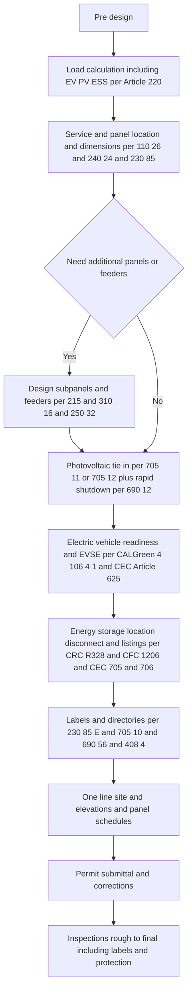
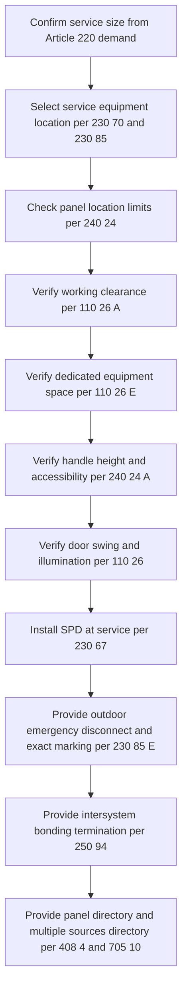
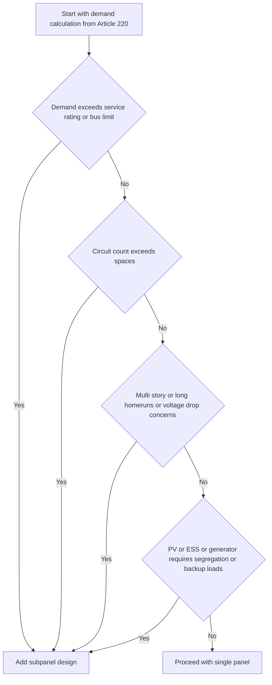
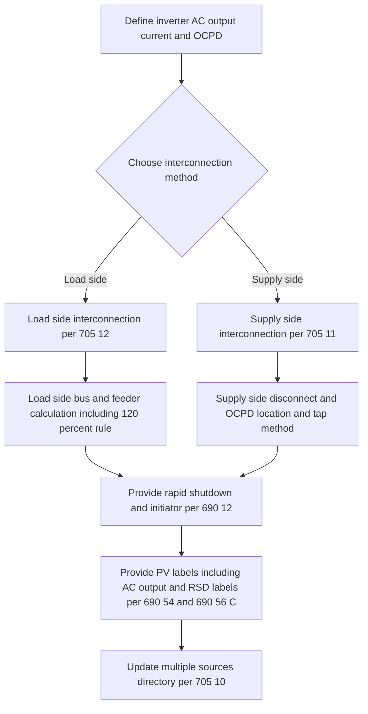
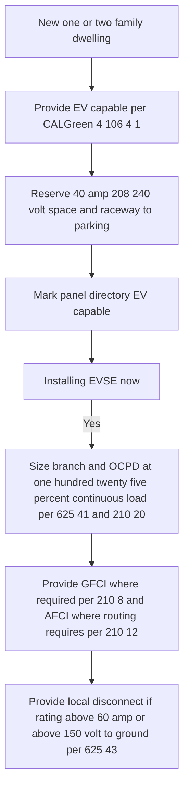
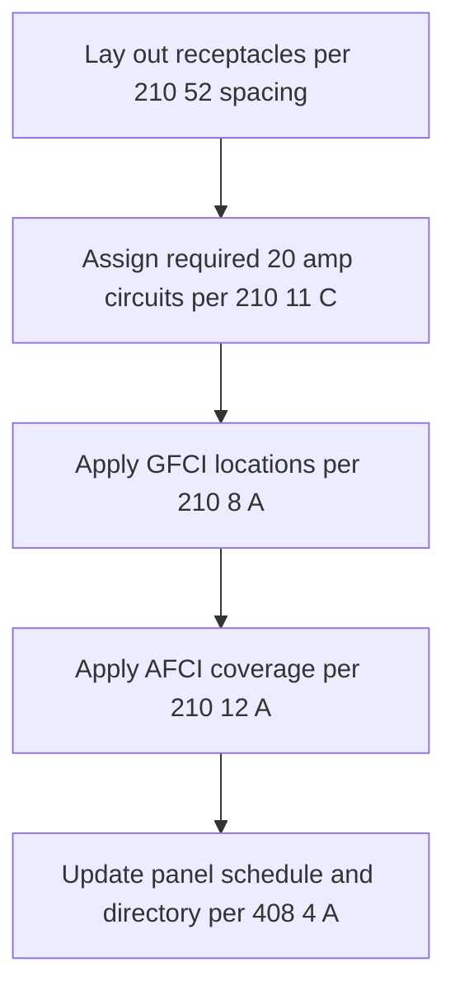
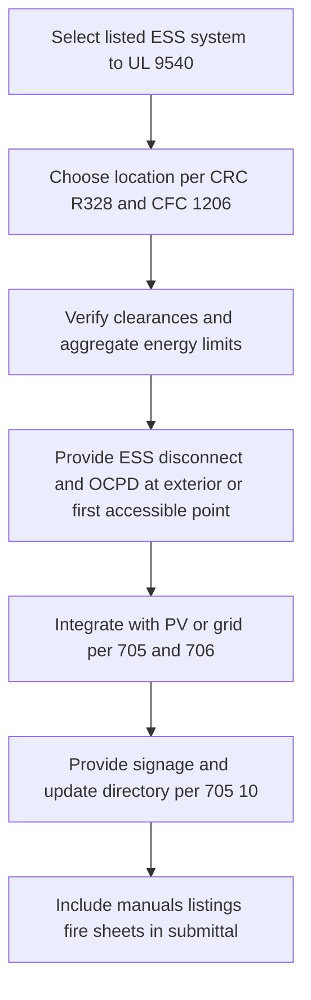

------

# California Residential Electrical Design and Permit Workflow

## A. Master end to end workflow



------

## B. Service and panel location and dimensions

### B1. Workflow



### B2. Quick rules to paste on drawings

| Topic                                 | Requirement                                                  | Code section        |
| ------------------------------------- | ------------------------------------------------------------ | ------------------- |
| Working space                         | Depth 36 in, width 30 in or width of equipment, height 6 ft 6 in | 110.26 A            |
| Door and egress                       | Door in working space opens 90 degrees                       | 110.26 A 2          |
| Illumination                          | Lighting required for the working space                      | 110.26 D            |
| Dedicated equipment space indoor      | Keep foreign systems out above panel to 6 ft above or structural ceiling | 110.26 E 1          |
| Dedicated equipment space outdoor     | Keep foreign systems above clear and protect from precipitation | 110.26 E 3          |
| Prohibited locations                  | No panelboards in bathrooms or clothes closets and not over steps | 240.24 D E F        |
| Handle height and access              | Operating handle at or below 6 ft 7 in and readily accessible | 240.24 A            |
| Outdoor emergency disconnect dwelling | Required and labeled per exact wording                       | 230.85 and 230.85 E |
| SPD at dwelling service               | Type 1 or Type 2 at service equipment                        | 230.67              |
| Intersystem bonding termination       | Provide at service                                           | 250.94              |
| Panel directory                       | Clear and specific circuit identification                    | 408.4 A             |
| Multiple sources directory            | Plaque at service identifying all source disconnect locations | 705.10              |

------

## C. Panel quantity and subpanel decision

### C1. Decision workflow



### C2. Subpanel design rules

- **Feeder sizing** per Article 215 and ampacity per Table 310.16.
- **OCPD for feeder** per 215.3 and 240.21.
- **Neutral isolated in subpanels** and **bond only at service** per 250.24 A 5.
- **Equipment grounding conductor** with feeder per 250.32 B 1.
- **Detached structure** requires building disconnect per 225.31 and 225.32 and a grounding electrode system per 250.32 A.
- Apply **working space and dedicated space** at every panel per 110.26 and 110.26 E.
- If PV backfeeds a subpanel apply **705.12** in that panel.
- Provide **panel directory** at each panel per 408.4 A and keep **705.10 directory** at service updated.

------

## D. PV integration

### D1. Workflow



**Design checkpoints**

- Load side rule example for a 200 amp bus: main 200 plus PV OCPD must be at or below 240 amps which is one hundred twenty percent of bus. Place PV breaker at the opposite end or per dwelling center fed allowance in 705.12.
- Supply side taps follow 705.11 and 230.46 with disconnect and OCPD outside or first readily accessible point and short conductor length typical ten feet in dwellings.
- Rapid shutdown and labels per 690.12 and 690.56 C.
- Service directory per 705.10 lists all sources and disconnect locations.

------

## E. EV infrastructure

### E1. Workflow



**Notes**
 EV receptacles in a garage and outdoors require GFCI per 210.8 A. Many projects choose a hardwired EVSE with integral personnel protection. Keep EV loads in the load calc as continuous.

------

## F. Room by room branch circuits

### F1. Workflow



### F2. Quick table

| Area            | Required circuits                                            | GFCI                                           | AFCI                                                | Other rules                                         |
| --------------- | ------------------------------------------------------------ | ---------------------------------------------- | --------------------------------------------------- | --------------------------------------------------- |
| Kitchen         | Two 20 amp small appliance circuits minimum                  | Yes for countertop and within six feet of sink | Yes                                                 | Spacing per 210.52 C and island and peninsula rules |
| Bathroom        | One 20 amp receptacle circuit dedicated                      | Yes                                            | As routed or per AHJ                                | Receptacle within three feet of basin per 210.52 D  |
| Laundry         | One 20 amp laundry circuit                                   | Yes                                            | Yes                                                 | —                                                   |
| Garage          | One 20 amp circuit for receptacles may also feed exterior receptacles | Yes                                            | Often required by current adoptions verify with AHJ | —                                                   |
| Habitable rooms | Circuits per load calc                                       | Not typically unless near sink                 | Yes                                                 | Spacing per 210.52 A                                |
| Outdoors        | At least one front and one rear receptacle                   | Yes                                            | Not required                                        | 210.52 E                                            |

------

## G. ESS energy storage integration

### G1. Workflow



**Notes**
 Typical residential limits include location in attached garage or outdoors with clearances and battery energy caps per room. Many AHJs require a heat detector in garages and clear placarding. Keep neutral and grounding rules correct if the system islands through a backup loads panel.

------

## H. Subpanel feeder sizing mini worksheet

Paste this into your E sheets and fill values.

```
Subpanel name: _______________________________
Location: ____________________________________

Load summary for this subpanel:
  General lighting and receptacles VA: __________
  Fixed appliances VA: _________________________
  HVAC VA: ____________________________________
  EVSE VA if landed here: _____________________
  PV backfeed if any: _________________________

Feeder calculations:
  Calculated demand amps at 240 V: ____________
  Continuous load portion amps: _______________
  Multiply continuous by 125 percent: _________
  Non continuous amps: ________________________
  Feeder minimum ampacity total: ______________

Feeder conductors:
  Conductor material and size: ________________
  Insulation type: ____________________________
  Temperature column used from Table 310 16: __
  Adjustments and corrections applied: ________

Overcurrent device at source:
  Rating amps: ________________________________
  Type: _______________________________________

Grounding and bonding:
  Equipment grounding conductor size per 250 122: ______
  Neutral isolated at subpanel yes or no: ______
  Bonding screw removed yes or no: _____________

Working and dedicated space:
  110 26 clearance and 110 26 E dedicated space confirmed
```

------

## I. Detached structure feeder one line and checklist

### I1. ASCII one line diagram

```
Main dwelling service equipment
  Outdoor emergency disconnect per 230 85
  Main service panel with SPD per 230 67

Feeder to detached structure
  Two pole feeder breaker rated ______ A per 215 3
  Feeder conductors ____ AWG material ____ insulation THHN or similar in conduit
  Equipment grounding conductor included with feeder per 250 32 B 1
  Neutral conductor isolated at detached structure panel

Detached structure panel
  Building disconnect per 225 31 and 225 32
  Grounding electrode system per 250 32 A with electrode conductor size ______
  Panel working space per 110 26 and dedicated space per 110 26 E
  Directory per 408 4 A

If PV or ESS located at detached structure
  Apply 705 11 or 705 12 at that structure
  Provide local disconnects and labels and update 705 10 directory at dwelling service
```

### I2. Detached structure checklist

- Feeder sized and protected per 215 and 240.
- Four wire feeder hot hot neutral equipment ground.
- Grounding electrode system at detached building per 250.32 A.
- Building disconnect at detached building per 225.31 and 225.32.
- Neutral isolated and equipment grounding conductor bonded to enclosure at detached panel.
- Working space and dedicated space verified.
- Labeling and directories updated.

------

## J. Label and placard package text

Use these exact texts in your label schedule.

```
Emergency disconnect at dwelling service
  Text line 1: EMERGENCY DISCONNECT
  Text line 2: SERVICE DISCONNECT
  Apply per 230 85 E

If meter disconnect not service equipment
  Text: EMERGENCY DISCONNECT METER DISCONNECT NOT SERVICE EQUIPMENT

Multiple sources directory at service per 705 10
  Text: CAUTION MULTIPLE SOURCES OF POWER
  Include locations of Utility Service Disconnect PV AC Disconnect or backfeed breaker ESS Disconnect
  Include service contact phone

PV AC point of interconnection label per 690 54
  Text: PHOTOVOLTAIC SYSTEM AC POINT OF CONNECTION
  Rated AC output current _____ A  Nominal AC voltage _____ V

Rapid shutdown label per 690 56 C
  Text: PV SYSTEM EQUIPPED WITH RAPID SHUTDOWN
  Instruction to operate the rapid shutdown switch to off
```

------

## K. What to include in the permit set

- Cover sheet with scope summary and the **subpanel feeder worksheet** filled where applicable.
- Site plan and exterior elevations showing **panel and disconnect locations** and **rapid shutdown initiator**.
- One-line diagrams for **utility service**, **PV**, **ESS**, **EVSE** and **detached structures**.
- Panel schedules with **AFCI and GFCI indications** and **directory text**.
- Label schedule using the texts in section J.
- Product cut sheets: PV inverter, ESS system UL 9540, EVSE, SPD.
- Load calculation per Article 220.
- Fire notes for ESS referencing CRC R328 and CFC 1206 where applicable.

