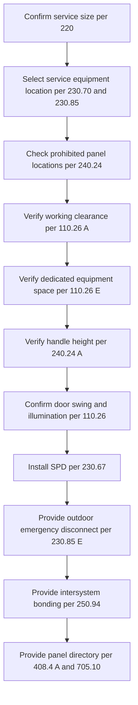
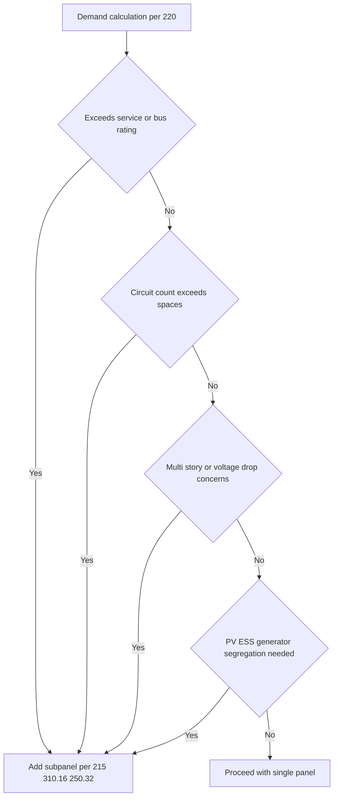
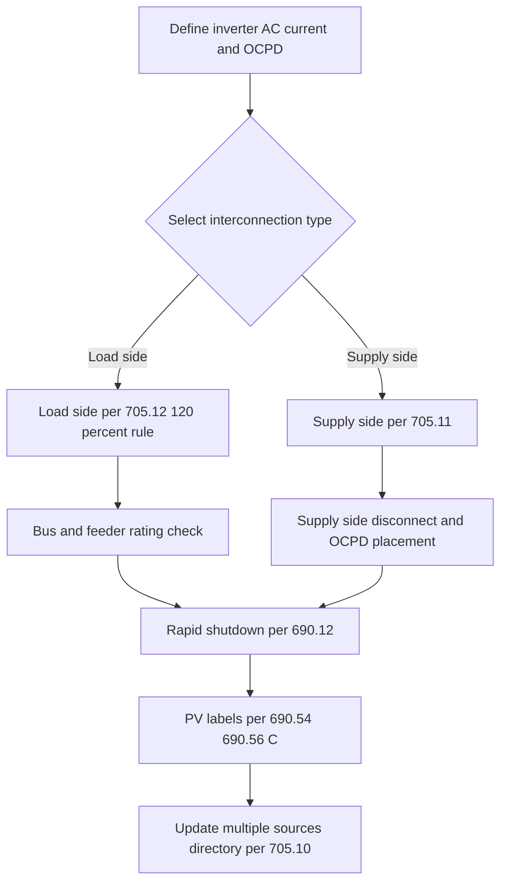
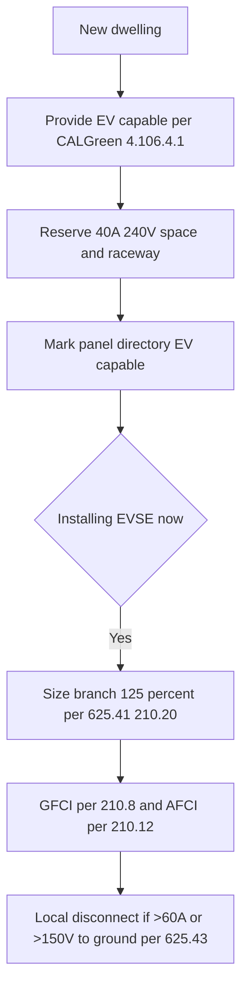
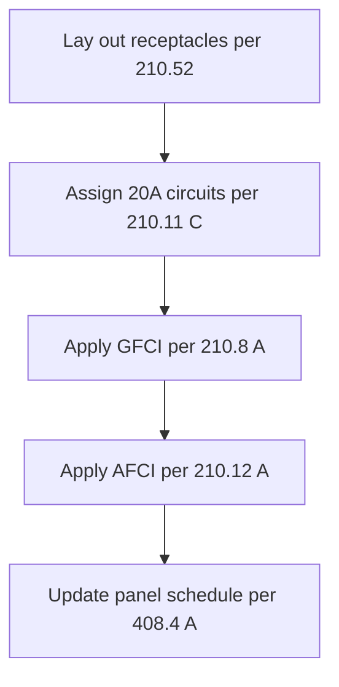
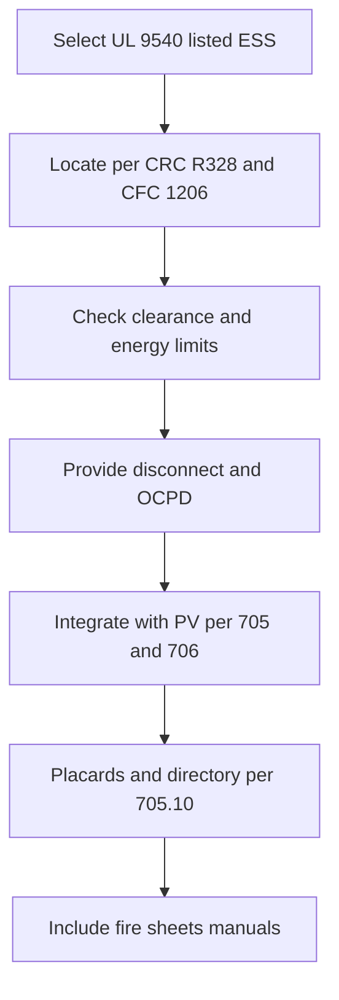

# California Residential Electrical Design & Permit Workflow (2025+)

------

## Executive Summary

California residential electrical design and permitting for **one- and two-family dwellings** is governed by:

- **2025 California Electrical Code (CEC, Title 24 Part 3)** — based on the NEC with state amendments
- **CALGreen (Title 24 Part 11)** — mandatory EV infrastructure requirements
- **California Energy Code (Title 24 Part 6)** — load calculations, efficiency measures
- **CRC R328** & **CFC 1206** — energy storage/fire requirements
- Local amendments (L.A. County, Bay Area jurisdictions)

Key drivers include:

- Outdoor emergency disconnects
- Surge protection at services
- PV rapid shutdown & placards
- EV-capable infrastructure (CALGreen)
- Room-by-room AFCI/GFCI enforcement
- UL 9540-listed ESS placement & fire safety

------

## 1. Service and Panel Location, Dimensions, and Directories

### Diagram

### Blank Table (Template)

| Code | Requirement | Rationale | Verified (Y/N) | Notes |
| ---- | ----------- | --------- | -------------- | ----- |
|      |             |           |                |       |

### Sample Completed Table

| Code   | Requirement        | Rationale                              | Verified (Y/N) | Notes                 |
| ------ | ------------------ | -------------------------------------- | -------------- | --------------------- |
| 110.26 | 36" clearance      | Prevents shock/fire during maintenance | Y              | Inspector confirmed   |
| 230.85 | Outdoor disconnect | Firefighter shutoff                    | Y              | At meter, labeled     |
| 230.67 | Surge protection   | Prevents transient damage              | Y              | SPD Type 2 at service |
| 408.4  | Panel directory    | Required for identification            | Y              | Completed and affixed |

------

## 2. Subpanels and Feeders

### Diagram

### Blank Table

| Code | Requirement | Rationale | Verified (Y/N) | Notes |
| ---- | ----------- | --------- | -------------- | ----- |
|      |             |           |                |       |

### Sample Completed Table

| Code   | Requirement           | Rationale         | Verified | Notes               |
| ------ | --------------------- | ----------------- | -------- | ------------------- |
| 215    | Feeder OCPD at source | Prevents overload | Y        | 100A feeder breaker |
| 310.16 | Feeder ampacity       | Matches demand    | Y        | 2 AWG Cu @ 100A     |
| 250.32 | GES at detached       | Safety ground     | Y        | Two rods at shed    |

------

## 3. Photovoltaic System Integration

### Diagram

### Blank Table

| Code | Requirement | Rationale | Verified | Notes |
| ---- | ----------- | --------- | -------- | ----- |
|      |             |           |          |       |

### Sample Completed Table

| Code   | Requirement     | Rationale            | Verified | Notes                       |
| ------ | --------------- | -------------------- | -------- | --------------------------- |
| 705.12 | 120% bus calc   | Prevents overheating | Y        | 225A bus, 200A main, 40A PV |
| 690.12 | Rapid shutdown  | Firefighter safety   | Y        | Initiator at exterior       |
| 690.54 | AC output label | Required marking     | Y        | Label affixed               |

------

## 4. EV Infrastructure

### Diagram

### Blank Table

| Code | Requirement | Rationale | Verified | Notes |

### Sample Completed Table

| Code               | Requirement        | Rationale             | Verified | Notes                     |
| ------------------ | ------------------ | --------------------- | -------- | ------------------------- |
| CALGreen 4.106.4.1 | EV capable raceway | State mandate         | Y        | 1" EMT to garage          |
| 625.41             | Circuit sized 125% | Prevents breaker trip | Y        | 50A breaker for 40A EVSE  |
| 210.8              | GFCI               | Shock protection      | Y        | 240V receptacle protected |

------

## 5. Room-by-Room Circuits

### Diagram

### Blank Table

| Space | Circuit | Ampacity | AFCI | GFCI | Code | Rationale |
| ----- | ------- | -------- | ---- | ---- | ---- | --------- |
|       |         |          |      |      |      |           |

### Sample Completed Table

| Space       | Circuit  | Ampacity  | AFCI | GFCI | Code                | Rationale                 |
| ----------- | -------- | --------- | ---- | ---- | ------------------- | ------------------------- |
| Kitchen SA1 | 20A 120V | 20A       | Y    | Y    | 210.11(C)(1), 210.8 | Required small appliance  |
| Bath        | 20A 120V | 20A       | Y    | Y    | 210.11(C)(3)        | Dedicated bath receptacle |
| Laundry     | 20A 120V | 20A       | Y    | Y    | 210.11(C)(2)        | Laundry receptacle        |
| Garage      | 20A 120V | 20A       | Y    | Y    | 210.11(C)(4)        | Required garage circuit   |
| Bedroom     | 15A/20A  | AFCI only | Y    | N    | 210.12              | AFCI required in bedrooms |

------

## 6. Energy Storage Systems (ESS)

### Diagram

### Blank Table

| Code | Requirement | Rationale | Verified | Notes |

### Sample Completed Table

| Code     | Requirement    | Rationale            | Verified | Notes                  |
| -------- | -------------- | -------------------- | -------- | ---------------------- |
| UL 9540  | Listed ESS     | Product safety       | Y        | Tesla Powerwall        |
| CRC R328 | Location limit | Fire separation      | Y        | Wall-mounted in garage |
| 705.10   | Directory      | Multi-source marking | Y        | Updated                |

------

## 7. Detached Structures

### Blank Table

| Code | Requirement | Rationale | Verified | Notes |

### Sample Completed Table

| Code   | Requirement      | Rationale  | Verified | Notes                   |
| ------ | ---------------- | ---------- | -------- | ----------------------- |
| 225.31 | Local disconnect | Safety     | Y        | 100A MCB at shed        |
| 250.32 | GES at detached  | Grounding  | Y        | Two rods bonded         |
| 215.3  | OCPD at source   | Protection | Y        | Feeder breaker in house |

------

## 8. Label Schedule

| Code      | Label Wording                                                | Purpose             |
| --------- | ------------------------------------------------------------ | ------------------- |
| 230.85(E) | “EMERGENCY DISCONNECT — SERVICE DISCONNECT”                  | Firefighter shutoff |
| 705.10    | “CAUTION — MULTIPLE SOURCES OF POWER”                        | Alert personnel     |
| 690.54    | “PHOTOVOLTAIC SYSTEM AC POINT OF CONNECTION”                 | Identify PV tie-in  |
| 690.56(C) | “PV SYSTEM EQUIPPED WITH RAPID SHUTDOWN — OPERATE RAPID SHUTDOWN SWITCH TO OFF” | Firefighter safety  |

------

## 9. Plan Stamp Code Citation Block

| Citation           | Scope                           |
| ------------------ | ------------------------------- |
| 110.26             | Working space, illumination     |
| 240.24             | Panel location & handle height  |
| 230.85             | Emergency disconnect            |
| 230.67             | Surge protection device         |
| 250.94             | Intersystem bonding termination |
| 408.4              | Panel directories               |
| 705.10/11/12       | PV interconnections             |
| 690.12/54/56(C)    | PV shutdown & labels            |
| CALGreen 4.106.4.1 | EV-capable mandate              |
| CRC R328           | ESS siting                      |
| CFC 1206           | ESS fire provisions             |

------

## Appendix: Fillable PDFs

📄 **Electrical Workflows & Checklists v4** (separate file) includes:

- Service & Panel
- PV with bus calc helper
- EV with continuous load helper
- Kitchen island/peninsula
- Room-by-room (breaker, wire, AFCI/GFCI type)
- ESS
- Detached Structures
- Label Schedule blocks
- Plan Stamp page

